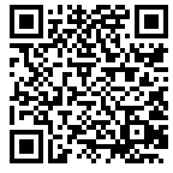

Donate IOTA
===========

Do you think my contributions to IOTA are useful? Show your appreciation with a donation:

New (rebased):

    0xc99159bd574e1c723bef21e10c7557ad4cf455bd837de8be72f757784cccc163

Old (stardust):

    iota1qrdw48dl6sr4ftu926pwvfscxr9vmpsdwymayhgdfvkduwjaw4345llmfa3

Donate Shimmer
--------------

Do you think my contributions to Shimmer are useful? Show your appreciation with a donation:

    smr1qr9qmrru4krz526g5p6p8uryql02xht0c9k3ejnc8vtsq8nnrfrasqf7s4t

Thank you!
----------

<i>This repo exists as on the legacy network, IOTA addresses needed to be cycled before money can be withdrawn. Therefore this is the one canonical place where you will
always be able to find my current IOTA donation address</i>
