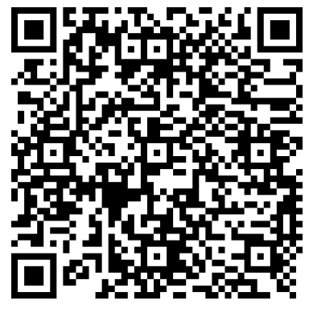

Donate IOTA
===========

Do you think my contributions to IOTA are useful? Show your appreciation with a donation:

    iota1qrdw48dl6sr4ftu926pwvfscxr9vmpsdwymayhgdfvkduwjaw4345llmfa3

This address is dust enabled on the Chrysalis network, so you can send amounts less than 1 Mi.

Thank you!
----------

<i>This repo exists as on the legacy network, IOTA addresses needed to be cycled before money can be withdrawn. Therefore this is the one canonical place where you will
always be able to find my current IOTA donation address</i>